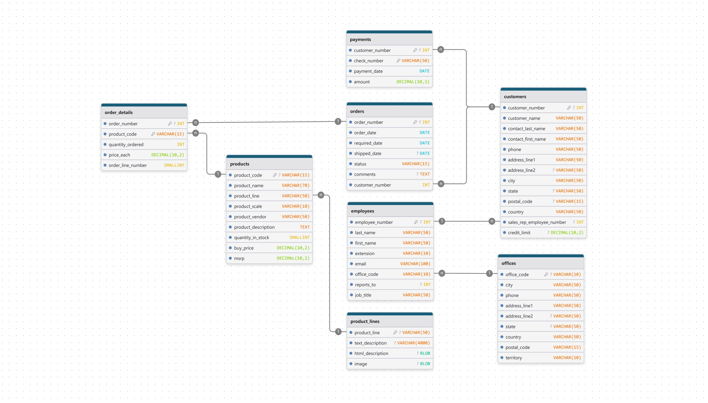

# business-database-postgresql

Business Database converted to PostgreSQL with snake_case naming conventions — includes schema and seed data for 8 tables. Made with love by yours truly.

## Overview

This is a PostgreSQL-compatible version of the [Business Database](https://www.kaggle.com/datasets/himelsarder/business-database) dataset by himelsarder on Kaggle. It has been adapted to follow a consistent **snake_case** naming convention across all table and column names.

The database models a sales and order management system, covering products, customers, orders, employees, and payments.

## Database Schema

The database consists of 8 tables:

| Table | Description |
|---|---|
| `product_lines` | Product categories (e.g. Classic Cars, Motorcycles, Ships) |
| `products` | Individual scale model products with pricing and stock info |
| `offices` | Company office locations around the world |
| `employees` | Staff records including reporting hierarchy |
| `customers` | Customer accounts with credit limits and sales rep assignments |
| `payments` | Payment records per customer |
| `orders` | Customer orders with status tracking |
| `order_details` | Line items for each order (product, quantity, price) |

### ERD



## Naming Conventions

This dataset follows the naming rules defined in the Pre-Sprint documentation:

- Table and column names use **snake_case**, all lowercase
- Multi-word names are joined with underscores (e.g. `product_line`, `order_number`)
- No camelCase (e.g. `productLine` → `product_line`)
- The original `MSRP` column is normalized to `msrp`

## Getting Started

### Requirements

- PostgreSQL 13 or higher

### Setup

1. Clone the repository:
   ```bash
   git clone https://github.com/your-org/business-database-postgresql.git
   cd business-database-postgresql
   ```

2. Create the database:
   ```bash
   createdb business_database
   ```

3. Load the schema and seed data:
   ```bash
   psql -d business_database -f business_postgresql.sql
   ```

4. Verify the setup:
   ```sql
   \dt
   SELECT COUNT(*) FROM products;
   ```

## Sample Queries

**List all product lines:**
```sql
SELECT product_line, text_description
FROM product_lines;
```

**Top 5 customers by credit limit:**
```sql
SELECT customer_name, country, credit_limit
FROM customers
ORDER BY credit_limit DESC
LIMIT 5;
```

**Total revenue per order:**
```sql
SELECT order_number, SUM(quantity_ordered * price_each) AS total
FROM order_details
GROUP BY order_number
ORDER BY total DESC;
```

**Employees and their managers:**
```sql
SELECT
    e.first_name || ' ' || e.last_name AS employee,
    m.first_name || ' ' || m.last_name AS manager
FROM employees e
LEFT JOIN employees m ON e.reports_to = m.employee_number;
```

## Source

Original dataset: [Business Database — Kaggle (himelsarder)](https://www.kaggle.com/datasets/himelsarder/business-database)
> A Comprehensive Sales and Order Management Database